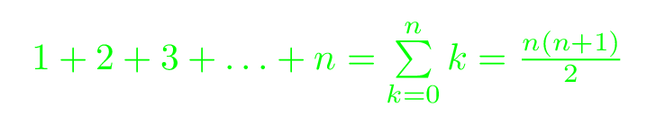

# FasTeX

Quickly compile LaTeX epxressions to beautiful PNGs.

```sh
fastex --color green --margin 5 "1+2+3+\dots + n = \sum\limits_{k=0}^n k = \frac{n(n+1)}{2}"
```

This will result in the following PNG to be saved to your current directory:


## Installation

```sh
cargo install --git https://github.com/BaumianerNiklas/fastex
```

### Dependencies

1. A working version of LuaLaTeX
2. [ImageMagick](https://imagemagick.org/), specifically for its `convert` command.

FasTeX will not work when one of these dependencies is missing from your `PATH`. They are not crates, so you will have to install them yourself.

## To Do

-   Better error handling
-   Customize output file name
-   Support for other LaTeX engines besides LuaLaTeX
